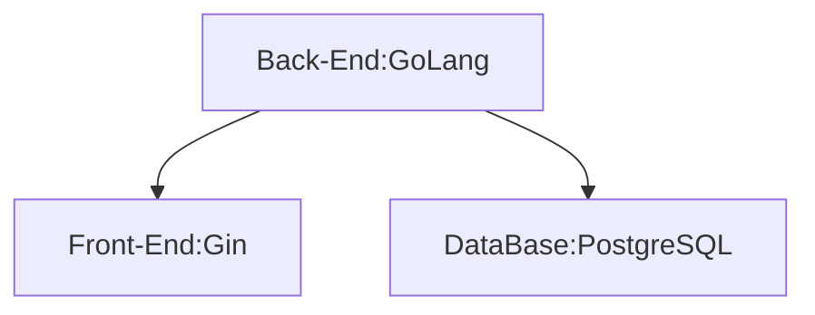

#goLang, #web, #db 

本篇是一個總覽，會寫出動機、架構，與介紹後面篇章，並且放上最終成果在此。

一直以來有記錄薪水的習慣，最近正面臨工作轉換之際。剛好也想想學習一個新的後端語言，並建立一個練習Web應用，苦於找不到一個學習的目標。因此突發奇想，利用這個機會，學習如何開發一個完整的網站。因此才有了這篇文章，是做個記錄，也是留給未來的自己看看過往成長的歷程。

### 目標與需求

目標：希望建立一個Web應用，存放個人資料
1. 利用資料庫存放個人資訊。如：自我介紹、公司、薪資、薪資結構、福利等
2. 透過後端API進行資料交互
3. 透過前端框架將頁面load出來

需要練習：
1. `cluster` or `loading balance + ngix`
2. `GoLang`目錄結構化

### 規格

#### 硬體
在硬體規格挑選上，使用現有的notebook。比較特別的是選擇使用Ubuntu的OS，原因也沒什麼特別的，就是使用open source習慣了。軟體這裏就得思考了一下，因爲要建立一個Web應用，必須使用到資料庫、後端語言、前端框架。

* ACER notebook
* Processor：Intel® Core™ i7-7700HQ CPU @ 2.80GHz × 8
* Memory：16 GB
* Graphics：NVIDIA GeForce GTX 1050 Ti/PCIe/SSE2
* OS：Ubuntu 18.04 LTS

#### 軟體

資料庫可以使用`PostgreSQL`、`MongoDB`；後端語言可以選擇`GoLang`、`Node.JS`;前端框架基本上是依照後端的選擇，使用該語言最熱門的框架，這樣可以少走一點冤枉路。

話不多說，先上規格：
* DataBase：`PostgreSQL`
* Back-End：`GoLang`
* Front-End：`Gin`

### 說明

最終資料庫選擇`PostgreSQL`。一方面是開源的RDB，在未來在工作上使用機會可能也較多，另一方面是NoSQL的`MongoDB`過去工作已經用的比較熟悉了。所以就無腦選擇`PostgreSQL`作爲這次實驗的資料庫啦～

後端語言選擇的是`GoLang`。原因是個人比較熟悉的`Python`、`JavaScript`、`Node-Red`、`Node.JS`都是弱型別的語言。我們都知道弱型別雖然可以高速開發省去很多麻煩，但也容易遇到runtime errors，而且還特別不好除錯！也因爲是給自己的練習，所以趁這個機會，好好入手一個強型別語言，因此就挑選使用`GoLang`啦～

針對`GoLang`來選擇時下最流行的前端框架，看起來是`Gin`。剛好我也喜歡喝琴酒，作爲一個初學者，看來我是沒有選擇，因此就跟跟大家的風，來一杯82年的`Gin`吧～

> 來一個奇怪的知識點，`GoLang`的前端框架還有一個叫做`Martini`，這些阿兜仔怎麼那麼奇怪，都喜歡用酒來命名...
[GoLang 前端框架排名](https://learnku.com/articles/37364)
[GoLang 有哪一些好用的前端框架](https://www.zhihu.com/question/27370112)

### 任務拆解

* [1-建立GoLang開發環境](1-建立GoLang開發環境.md)
* [2-利用GoLang 建立第一個Web 應用](2-利用GoLang%20建立第一個Web%20應用.md)
* [3-實戰GoLang 建立Web 應用](3-實戰GoLang%20建立Web%20應用.md)
* 建立`PostgreSQL`環境
* 利用`GoLang`調用DB
* 利用Gin整合
* [[../../todo/MVC]]設計模式
* 使用[[RestFul API]]實現調用DB(到這裏基本的網頁應該大致上成型了，再來就是開始練習結構化)
* 進階與其他應用
    * 調整架構爲Loading balance
    * 導入測試 go test
    * 開始自動化測試CI/CD
    * 加上Swagger godocs

### 參考資料

go-developer-roadmap
https://github.com/eddycjy/go-developer-roadmap

Gin实践 连载一 Golang介绍与环境安装
https://segmentfault.com/a/1190000013297625

Day7 | 使用 GoLang 與資料庫進行互動
https://ithelp.ithome.com.tw/articles/10234657

項目結構

Gin实现依赖注入 项目结构
https://studygolang.com/articles/24602

Golang 简洁架构实战
https://zhuanlan.zhihu.com/p/454054072?utm_id=0

用 go 实现一个简单的 mvc

https://learnku.com/articles/29546

Go 项目结构：如何在 Go 项目中使用 MVC ？

https://learnku.com/go/t/48112

layout 常见大型 Web 项目分层
https://chai2010.cn/advanced-go-programming-book/ch5-web/ch5-07-layout-of-web-project.html

(20) Controller、Service、Repository的建立 - 1 _ JpaRepository 的使用
https://medium.com/learning-from-jhipster/20-controller-service-repository%E7%9A%84%E5%BB%BA%E7%AB%8B-1-jparepository-%E7%9A%84%E4%BD%BF%E7%94%A8-6606de7c9d41
> View 專注於資料的呈現頁面
Controller 負責 API 的接口
Service 處理背後的商業邏輯
Repository 專門與資料庫進行操作
Model 作為資料與 DAO 的 Mapping

自己給自己走個流程？留個念想？不要說爲了技術而技術...要知道技術的本質是爲了解決硬需求。

* Q：網頁開發需要準備什麼工具？
* A：基本上會寫一個後端語言，一個腳本就可以搞定。
    * 後臺直接撰寫程式語言，內含hmtl的string
    * html的string的文檔太多，不利於程式開發，將html的內容抽離出來
    * 網站越做越漂亮，業務邏輯越來越龐大，開始有了DB專門管理資料，html、css、JavaScript等處理前端顯示。
    * 一套程式越做越大，越來越複雜，為了便於程式開發與工程師之間的合作，開始有了MVC架構。將龐大的項目，結構化、工程化。
    * 前端裝置越來越多，為避免邏輯分散，並使邏輯複用，開始有了前後端分離的概念。前端負責畫面跳轉、使用者，後端負責業務邏輯與資料處理。
    * 使用的裝置越來越多，後端撐不住，開始有了loading balance、cluster架構，處理高並發問題。
* Q：很多程式開發，爲什麼需要資料庫？
* A：資料庫是一個存儲的平臺。其實若存儲的資料不多，我們也可以使用文檔存儲資料，例如存放config等。當資料越來越多，且資料的形態都很類似，那麼便可以引入資料庫來統一管理數據。這裏下個小結論
    * 資料相似性低、數量少、完全不可以接受offline用文檔管理
    * 資料相似性低、數量少用DB管理
* Q：爲什麼需要前後端分離？
* Q：想想以前開發網頁的流程。
* Q：爲什麼需要MVC？
* Q：爲什麼需要RestFul架構？
* Q：爲什麼html需要模版？
* 

