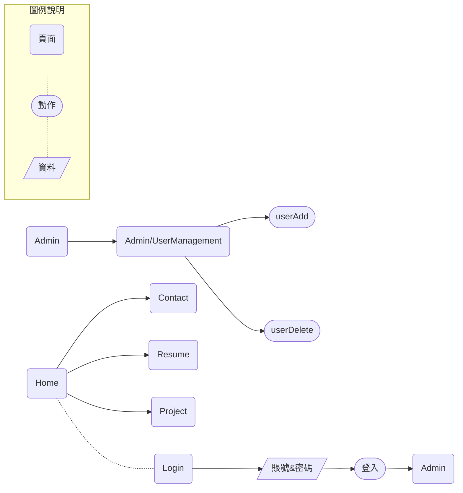

#goLang, #web 


上篇簡單粗暴地實現Web 應用，實際上感覺還不夠強烈，畢竟還是複製貼上別人的代碼比較多，還不如出個題目給自己實踐一下。

另外，雖然完全沒有開發過Web 應用，不過在網上也看過很多人說開發時要導入MVC、RestFul、前後端分離之類的架構。雖然知道最終一定會導入架構，但不想爲了單純爲了技術而開發，所以透過練習開發Web 應用，感受一下在沒有架構的情況下開發，到底會有多不方便。這樣也可以很明確的瞭解這些架構、框架的導入到底有多重要。

回到正題，針對我們的目標，會希望有個**首頁可以放些個人資訊**，有個**後臺頁面存放敏感資料**。

---
### 需求與目標

* 實現一個可以概覽的首頁（首頁可以放自我介紹、聯絡資訊等）
* 實現一個可登入頁面，成功登入後，跳轉後臺
* 後臺可以存放敏感資料或是管理頁面等

> 對於網站設計實在是沒什麼概念，所以找了一個範本網站來做參考。所謂程式開發...從複製、貼上開始。所以來參考一下吧～[網站設計範本](https://zh.wix.com/website/templates/html/portfolio-cv)

---
### SA

對於user 來說，在一個Web 應用中，最重要的無非就是**頁面**、**動作**、**資料**。因此可以針對需求結合這三個元素畫成SA，如下圖。

#### SA架構



Okey，小小練習不要一開始就把目標畫的太大，最後很快又要翻掉的(誤)。總之，雖然還有很多東西要完成，不過敏捷式學習吧～

#### SA說明

個人頁面應該會有**Home**、**Contact**、**Resume**、**Project**等頁面，裏面放上個人資訊等。另外有個不顯示在網頁上的頁面**Login**，用來登入後臺管理頁面。後臺管理頁面可以做到用戶管理。

細部規劃
* 實現Home、Contact、Resume、Project頁面，頁面之間可以相互跳轉 《 拉layout拉到放棄，前端的人真的很厲害
    * Home：放上概覽
    * Contact：放上聯絡資訊
    * Resume：按照之前寫好CV的樣式，放上履歷
    * Project：用表格？簡介一下side project
* 實現可以登入後臺頁面
    * Login頁面，不存在與首頁中。
    * 在Login頁面中，輸入賬號密碼後，驗證通過可以跳轉至後臺
* 後臺頁面實現用戶管理功能
    * 預設有個最大admin賬號不能被刪除
    * 用戶管理頁面顯示目前的用戶列表
    * 實現新增、刪除用戶的功能

不小心就列的太細了...沒關係，再來規劃一下怎麼實現吧～

---
### SD

因爲是自己寫的系統，而且很快就要翻掉，就不畫太詳細的SD了。

按照功能面來說，可以拆成三個大功能：
* 頁面跳轉：應該是用前端js實現即可。
* 登入驗證：資料會通過js傳送到後端，驗證過後，後端對前端下指令跳轉頁面。
* 用戶管理（新增、刪除），因爲沒有DB，所以打算用本地的記事本存放資料。

這裏比較疑惑的是登入驗證後端如何讓網頁跳轉？在我的理解，頁面跳轉應該都是user操作網頁使前端跳轉。這樣看起來，應該要找方法讓後端對前端下指令才對。

---
### 功能實作


爲了快速實現功能，這裏先使用純後端開發。

首頁搭建

看來畫面跳轉只需要使用href標籤即可達到。

原本認爲一個畫面的跳轉就要寫一次HTML，看來大家都是把要跳轉的地方全部寫在一起。也是懶惰

```html
      <ul>
         <li>
            <a href="/">Home</a>
         </li>
         <li>
            <a href="/resume">Resume</a>
         </li>
         <li>
            <a href="/project">Project</a>
         </li>
         <li>
            <a href="/contact">Contact</a>
         </li>
      </ul>
```

html、css、js

沒有css會怎樣

什麼是前後端分離？網頁的前後端分離又是怎麼區分的？
因爲所在公司的環境，我專門處理後臺，負責丟資料給前端。所以，一直以來都以爲所有的程式開發都是前後端分離（就是這麼的傻...身在福中不知福？）。如今才知道，最早的網頁其實只有後端工程師，負責在Server端編寫前後臺，再講資料完整丟給Client端。


什麼是靜態網頁、什麼是動態網頁？

目前開發遇到的問題：
1. 一個頁面就必須寫一次HTML嗎？看起來是這樣的...只能說有些東西可以抽成模版...
2. 是否有工具可以達到HTML管理的效果，可以自動生成部分結構？是用前端框架？
3. 如果一個頁面裏面跳轉的HTML寫錯怎麼辦？只能人工排查嗎？自動測試？

https://ithelp.ithome.com.tw/articles/10233981

net/http套件詳解
https://willh.gitbook.io/build-web-application-with-golang-zhtw/03.0/03.4

GoLang net/http offical
https://pkg.go.dev/net/http#HandlerFunc.ServeHTTP

GoLang html/template offical
https://pkg.go.dev/html/template

前端框架簡介
https://developer.mozilla.org/zh-TW/docs/Learn/Tools_and_testing/Client-side_JavaScript_frameworks/Introduction
