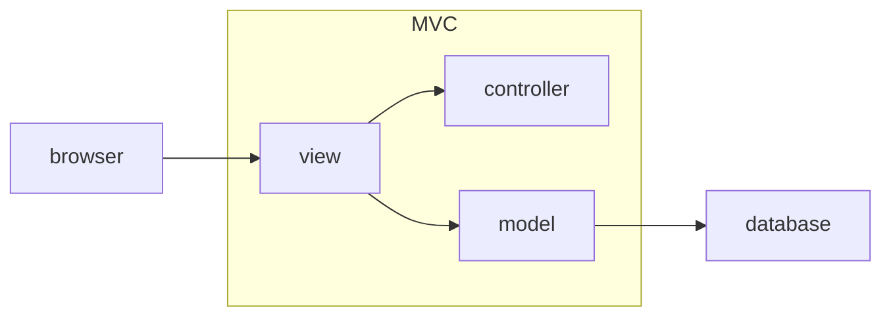

#goLang , #mvc
### 什麽是[MVC](../../todo/MVC)

MVC是Model、View、Controller 的縮寫，是希望能把應用程式的內部運作歸納成不同的部門，讓每個部門各自負責不同的關注點。具體的行為是「把不同意義的程式碼放在不同的檔案裡」。

view
model
controller

### MVC架構優缺點

#### 優點

* 架構龐大且兼容性極高
* 擴充性好並兼具彈性高的特性
* 出錯時，邏輯容易理解除錯

#### 缺點

* 代碼量增加，對於不熟悉架構的開發者來說，可能會因為不熟悉架構而導致開發發生困難。（其實沒增加幾行）
* HMI 開發完一次後，就比較不會去維護了，因此使用此架構開發，相對會導致開發時程拉長並限制住開發者的寫法

Model
Model 常譯為「模型」，負責和資料庫溝通。這裡我們要先注意：應用程式和資料庫是兩個不同的東西，在應用程式裡想要做「新增/瀏覽/修改/刪除」的動作，就需要先有 Model 層幫忙去資料庫裡取出必要的資料，把資料放進應用程式裡的某個程式物件，然後才能用 JavaScript 去操作該物件。

這種放資料、與資料庫連動的物件，會被稱為 Model 物件，由 Model 層來統一管理。

Model 管理的功能層被稱做「邏輯層」，更明確一點說，是和「商業邏輯」有關的功能，例如：

電商網站：

會員購物有九折、訂單超過一定的金額免運費
檢查登入帳號的類型，並依此開放不同權限
社交網站：判斷使用者彼此之間的友好程度

To-do List：過了期但沒被執行的 to-dos 不能被刪除

這些邏輯出自於產品本身的需求或是規則。它們是獨立於網頁介面的商業邏輯，如果之後又另外開發了如手機 App 等相關應用程式，這些商業邏輯在大部分情況是通用的。和這些邏輯相關的程式碼應該被分類到對應的 Model 檔案裡。

View
View 常譯為「視圖」，View 所管理的功能層叫作「表現層 (presentation layer)」，顧名思義是負責管理畫面的呈現，也就是 HTML 樣板 (template)。

在開發框架裡，因為 HTML template 會有需要以動態顯示資料的情況 (也就是由 Model 取出的資料內容)，所以 View 會再進一步運用樣板引擎 (template engine) 將資料帶入 template。我們很快就會在實作中看到相關細節。

Controller
Controller 常譯為「控制器」，它掌握使用者互動邏輯，也是應用程式收發 request/response 的核心。來自路由的 request 會先被送到 Controller，再由 Controller 通知 Model 調度資料，並且把資料傳遞給 View 來產生樣板 (template)，並將呈現資料的 HTML 頁面回傳給客戶端。

你可以把 Controller 想做是 MVC 架構的中間人，它決定了應用程式的工作流程 (workflow)，並且蒐集不同元件的工作結果，統一回傳給使用者。以下常見的設計問題，會由 Controller 來控制：

使用者是否需要先登入 (認證) 才可以看到網頁內容？
使用者是否只能閱讀資料，但不能修改或刪除？
使用者新增了資料之後，會重新導向至哪個頁面？
在 Controller 上會設置很多不同的「動作 (action)」，有點類似電視遙控器上的按鈕，只要觸發了不同的 action，Controller 就會啟動後續一系列的行為。

採用 MVC 架構三大好處
重複使用已寫好的程式碼：由於 MVC 三塊彼此獨立、各司其職，你可以使用同一套 model，針對使用場景不一樣，產出不同的 view 來呈現適合的資料，最大化程式碼的使用效率。
更容易維護程式碼：由於 MVC 三塊彼此獨立且互不干擾，可以讓你在不破壞現有架構下，進行擴充或修改，大幅提升開發效率。
方便團隊合作：同先前所說，由於 MVC 架構將應用程式切分為三塊，在實際工作時，也可以比照相同的方式，將工程師、設計師的負責部分切開，加快開發速度。

https://tw.alphacamp.co/blog/mvc-model-view-controller